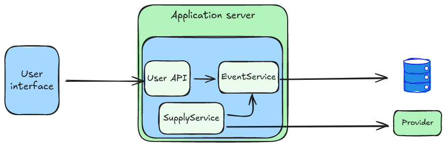

# Go Fun Events
[pipeline status](https://github.com/mblancoa/go-fun-events/actions)


## Project structure
Go Fun Events is implemented by  a hexagonal architecture and this is its distribution:

```
go-fun-events/
|-- core/
|   |-- events.go
|   |-- supply.go
|   |-- ports.go
|   |-- configuration.go
|
|-- adapters/
|   |-- xxx-provider/
|   |   |-- model.go
|   |   |-- provider.go
|   |   |-- configuration.go
|   |
|   |-- mongodb-respository/
|       |-- model.go
|       |-- repository.go
|       |-- configuration.go
|
|-- api/
|   |-- controllers/
|   |   |-- base.go
|   |   |-- events.go
|   |   |-- model.go
|   |
|   |-- configuration.go
|   |-- routers.go
|
|-- cmd/
|   |-- userapi/main.go
|   |-- supply/main.go
|
|-- go.mod
```
## Business logic description
TODO

## Step by step
### 1- Repositories generation
This step must be executed just when code is change and a new generation is necessary

- Installation: `go install github.com/sunboyy/repogen@latest`
- Generation: `make code-generation`

### 2- Swagger
- [Documentation](https://github.com/swaggo/swag#declarative-comments-format)
- Installation: `go install github.com/swaggo/swag/cmd/swag@latest`
- Generation: `make swagger`
- Configuration:
```go
package api

import (
	"github.com/astaxie/beego"
	_ "github.com/mblancoa/go-fun-events/docs"
	"github.com/rs/zerolog/log"
	swagger "github.com/weblfe/beego-swagger"
)

### 3- Test
- 1- Mocks

  - Installation: `go install github.com/vektra/mockery/v3@latest`
  - Generation: `make clean mocks`
- 2- Run tests
  - `make test`

func initRouters() {
	log.Info().Msg("Initializing events api routes")
	beego.Get("/swagger/*", swagger.Handler)
	...
}
```
### 4- Build
- User api application: `make build-api`
- Supply application: `make build-suplly`
- All: `make build`

## Prepare environment, build and deploy the project
- 1- Configure the application.yml file correctly (conf/application.yml)
- 2- Execute `make build` to build the package
- 3- Execute `make deploy`to run the application with docker-compose
- 4- Go to http://localhost:8080/swagger to try it
- 5- Execute `make stop` to shutdown the network

